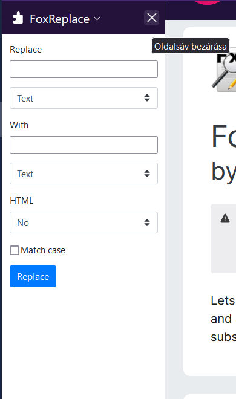
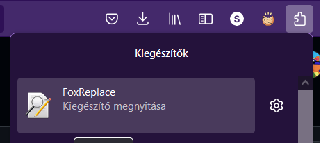
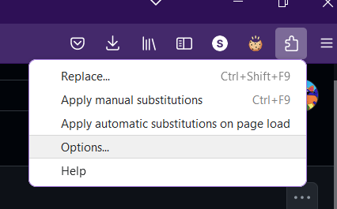
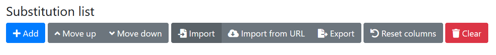
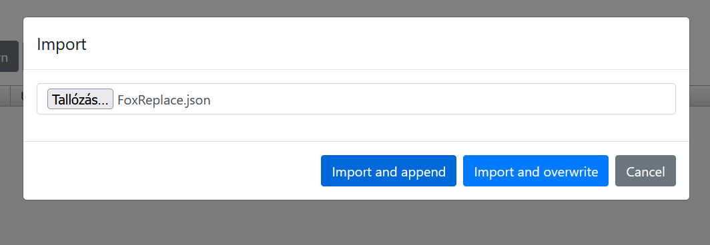
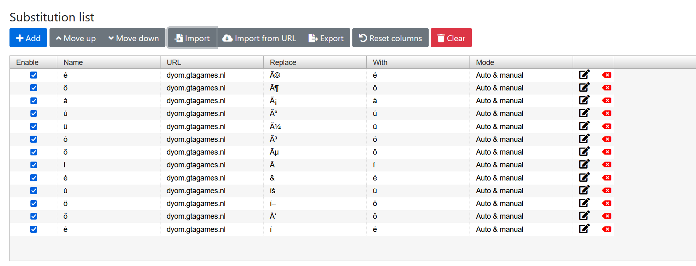
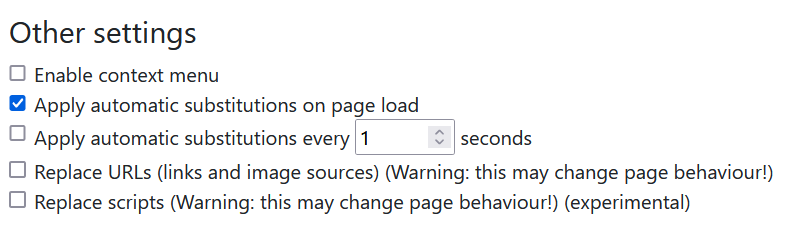
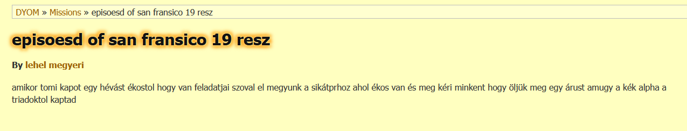

# Unfosítás GYOM-hoz

Töltsd le a FoxReplace kiegészítőt
> https://addons.mozilla.org/en-US/firefox/addon/foxreplace

Zárd be a oldalsávot

Nyomj rá a FoxReplace kiegészítőre

Majd a beállítások gombra

A szürke import gomb segítségével importáld be ezt a fáljt(letöltéshez: jobb klikk -> hivatkozás mentése más néven):
> https://raw.githubusercontent.com/z0ligit/DYOM-magyar/main/FoxReplace.json

Majd az "Import and append" gombot nyomd meg

Az akció után így kell kinéznie az oldalnak

Ha az "Apply automatic substitutions on page load" nincs bekapcsolva az oldal alján, akkor kapcsold be

Ha minden igaz és jól csináltad, akkor megjavultak a gyomos weboldalon az ékezetek

