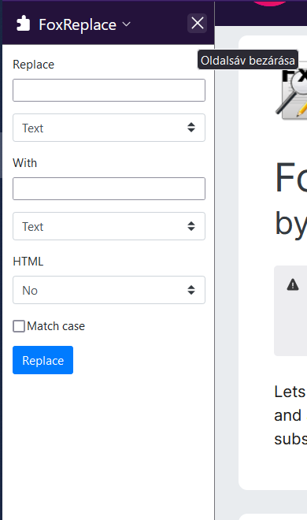
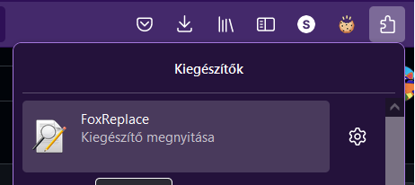
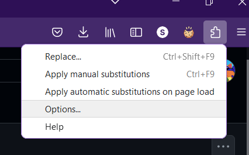
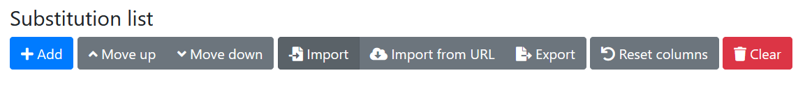

# Unfosítás GYOM-hoz

Töltsd le a FoxReplace kiegészítőt
> https://addons.mozilla.org/en-US/firefox/addon/foxreplace

Zárd be a oldalsávot

Nyomj rá a FoxReplace kiegészítőre

Majd a beállítások gombra

A szürke import gomb segítségével importáld be ezt a fáljt(letöltéshez: jobb klikk -> hivatkozás mentése más néven):
> https://raw.githubusercontent.com/z0ligit/DYOM-magyar/main/FoxReplace.json

